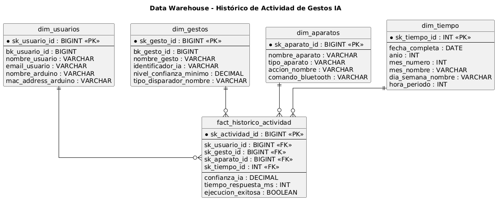
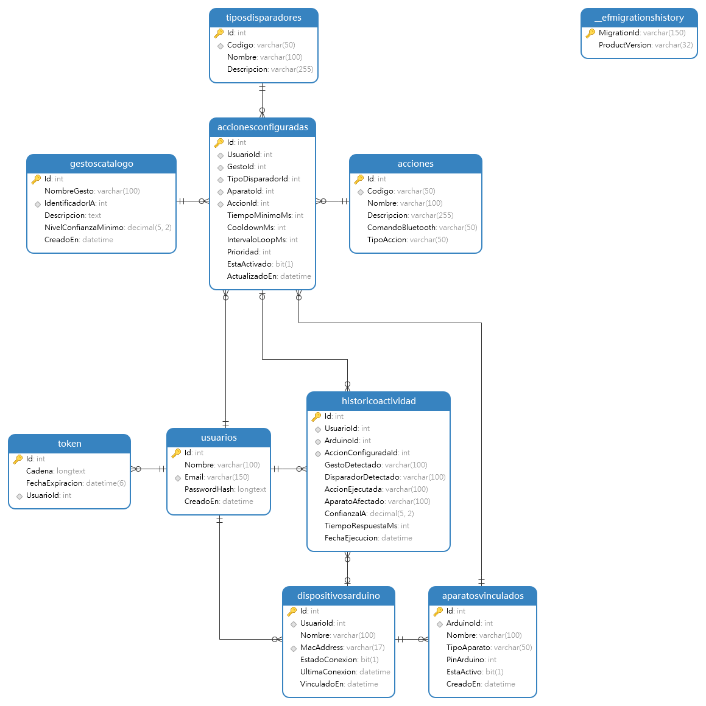

# Manordomo - Data Warehouse & Analytics

Este módulo del proyecto integrador **Manordomo** contiene el diseño, especificaciones técnicas y herramientas de preprocesamiento para la capa analítica y almacenamiento de inteligencia de negocio (BI). El objetivo es transformar los flujos de eventos de control domótico por gestos e IoT en un esquema óptimo para la auditoría, análisis de rendimiento de IA y reportería web.

---


## Laboratorio Interactivo (Google Colab)
[Abrir Notebook en Google Colab](https://colab.research.google.com/drive/1eY36YzHGZX0pxgheuFqsykGAZFwRlp35#scrollTo=5IhJdoS1Kd77)

---

## Estructura del Repositorio

El módulo está organizado de la siguiente manera:
* `data_warehouse.png`: Diagrama visual del modelo dimensional en estrella.
* `RESPALDO.sql`: Script SQL con la estructura de la base de datos transaccional mejorada (OLTP).
* `ejemplo-limpieza.py`: Script automatizado en Python para el proceso ETL y preprocesamiento de calidad.
* `dataset_manordomo_clean.csv`: Conjunto de datos de muestra depurado, listo para cargarse en el almacén analítico.

---

## Esquema del Data Warehouse



### Componentes del Modelo

1. **Tabla de Hechos (`fact_historico_actividad`)**:
   * **Métricas**: `confianza_ia` (precisión de la predicción de visión computacional), `tiempo_respuesta_ms` (latencia física extremo a extremo) y `ejecucion_exitosa` (flag analítico booleano).
   * **Claves Subrogadas**: Vinculación directa mediante llaves artificiales (`sk_`) hacia todas las dimensiones.

2. **Tablas de Dimensiones**:
   * **`dim_usuarios`**: Consolida la cuenta del operador y los datos de identificación física del hardware (`nombre_arduino`, `mac_address_arduino`).
   * **`dim_gestos`**: Mapea el catálogo global de señas entrenadas con MediaPipe (`nombre_gesto`, `identificador_ia`, `tipo_disparador_nombre`).
   * **`dim_aparatos`**: Clasifica los periféricos del hogar inteligentes conectados (`nombre_aparato`, `tipo_aparato`, `comando_bluetooth`).
   * **`dim_tiempo`**: Eje cronológico analítico desglosado (`anio`, `mes_nombre`, `dia_semana_nombre`, `hora_periodo`) para identificar patrones de uso horarios y diarios.

---

## Tipos y Fuentes de Datos

El almacén analítico procesa información proveniente de un entorno híbrido multi-fuente:
* **Base de Datos Relacional OLTP (MySQL)**: Datos de configuración fuertemente tipados (`INT`, `VARCHAR`, `DATETIME`, `BIT`).
* **Logs del Servidor de Visión Artificial**: Métricas analíticas de latencia y coeficientes de precisión de matrices de la mano.
* **Logs Seriales del Protocolo Bluetooth**: Registros de telemetría física de envío y recepción de comandos en la placa Arduino.

---

## Técnicas de Limpieza y Preprocesamiento de Datos

Antes de ingresar al Data Warehouse, los flujos brutos pasan por una tubería (Pipeline) de procesamiento construida con **Python** y **Pandas** que ejecuta las siguientes reglas de negocio:

* **Tratamiento de Nulos**: Eventos interrumpidos en la red móvil que carecen de nombre de gesto se rellenan automáticamente con la etiqueta `'No Identificado'` para asegurar la integridad referencial.
* **Homologación de Cadenas**: Limpieza de espacios en blanco accidentales (`.strip()`) y capitalización homogénea (`.title()`) en entradas de texto libre.
* **Desduplicación de Registros**: Eliminación de registros repetidos en milisegundos a nivel de hardware (causados por el reenvío de señales físicas en Bluetooth) manteniendo únicamente el primer evento válido.
* **Validación de Rangos Lógicos**: Corrección de anomalías de sensores. Los niveles de confianza de IA superiores al 100% se truncan a `100.00`, y las latencias de tiempo negativas (causadas por desincronización de reloj en servidores) se normalizan a `0`.
* **Cálculo de Métricas Derivadas**: Creación del campo compuesto `EjecucionExitosa` basado en el cumplimiento de umbrales operativos (Confianza $\ge$ 70% y Latencia $\le$ 1000ms).

---

## Ejecución del Pipeline de Limpieza

Para reproducir la transformación y generar un nuevo dataset limpio, asegúrate de tener instaladas las dependencias y ejecuta el script principal:

### Prerrequisitos
```bash
pip install pandas numpy
```

---

## Esquema del Modelo de Datos



